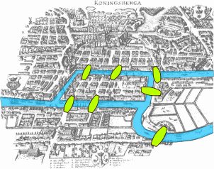

##

É possível desenhar esta figura sem tirar o lápis do papel e sem passar sobre uma linha duas vezes?

{width=3cm}

\pause

\center \Huge Sim!

##

E esta?

{width=6cm}

\pause

\center \Huge Não!

## O problema das Sete pontes de Königsberg

A cidade de Königsberg era cortada por um rio que continha duas ilhas e existiam 7 pontes que ligavam as ilhas e as margens do rios.

{width=3cm}

\pause

Os morados locais da época ficavam se perguntado se era possível fazer um caminho que cruzasse cada uma das 7 pontes uma única vez. O que você acha?

## O problema das Sete pontes de Königsberg

Em 1736 Leonhard Euler resolveu o problema mostrando que não existia tal caminho. \pause

Ele modelou o problema em termos abstratos \pause

{width=3cm} \pause

{width=3cm} \pause

{width=3cm}

## O problema das Sete pontes de Königsberg

Euler observou que toda vez que alguém atinge uma porção de terra por uma ponte, deve deixar a porção de terra também por uma ponte. \pause

Para que cada ponte fosse cruzada apenas uma vez, todas as porcões de terra, exceto talvez a inicial e a final, deveriam ter um número par de pontes ligadas a ela. \pause

Mas todas as porções de terra do problema tem um número ímpar de pontes, portanto, não é possível fazer o caminho. \pause

Surgiu então a Teoria dos Grafos.

## Número de Erdős

{width=3cm}

Paul Erdős foi um famoso matemático Húngaro.

Trabalhou com centenas de colaboradores.

Publicou mais de 1500 artigos.

## Número de Erdős

Número de Erdős é um divertido tributo criado pelos seus amigos \pause

- Paul Erdős tem número de Erdős 0 \pause

- Os colaboradores diretos dele tem número de Erdős 1 \pause

- Os colaboradores destes tem número de Erdős 2 \pause

- Assim sucessivamente

## Problema

Projete um algoritmo que determine o número de Erdős de cada pessoa em um conjunto de colaborações.

## Número de Erdős

{width=5.5cm}

## Número de Erdős

{width=5.5cm}

## Número de Erdős

{width=5.5cm}

## Número de Erdős

{width=5.5cm}

## Número de Erdős

{width=5.5cm}

## Algoritmo

Algoritmo

  - Atribua o número 0 ao Erdős

  - $d \leftarrow 0$

  - Repita até que todos as pessoas tenham um número ou $d = m$, onde $m$ é o número de relações

      - Para cada relação (Pessoa1, Pessoa2)

          - Se Pessoa1 tem número $d$ e Pessoa2 não tem número, então atribua
            o número $d + 1$ a Pessoa2

          - Senão se Pessoa2 tem número $d$ e Pessoa1 não tem número, então
            atribua $d + 1$ a Pessoa1

      - $d \leftarrow d + 1$

\pause

Veja a implementação deste algoritmo em C e em Python na página da disciplina.

## Número de Erdős

O algoritmo que construímos não é eficiente, ele analise a lista de relações diversas vezes... \pause

Podemos melhorar? \pause Sim! \pause Para isso vamos modelar o problema com um grafo:

  - Cada autor é representado por um vértice.

  - Cada colaboração entre dois autores é representada por uma aresta ligando os vértices que representam os autores;

\pause

Quando olhamos para um grafo construído dessa forma, o queremos encontrar que corresponde ao Número de Erdös? \pause A distância mínima do vértice que representa o Erdös para todos os outros vértices. \pause

Veremos em breve um algoritmo mais eficiente para resolver esse problema e também uma generalização para calcular distâncias mínimas com pesos, que pode ser aplicado por exemplo, para calcular rotas entre cidade.

## Campo minado

{width=5cm}

Como abrir as casas corretas após um clique do jogador? \pause

O problema pode ser modelado por um grafo:

  - Cada casa é representada por um vértice;

  - Se duas casas são vizinhas, então os vértices correspondentes são ligados por uma aresta.

## Campo minado

{width=5cm}

Qual o problema que queremos resolver? \pause

A partir de um vértice inicial $s$, encontrar todos os vértices $v$ tal que existe um caminho de $s$ para $v$ que passe apenas por vértices que representem casas sem bombas ao redor.

## Campo minado

Algoritmo

  - Se a casa selecionada está fechada, abra a casa, senão pare
  - Se a casa selecionada não tem bombas ao redor, abra todas as casas vizinhas recursivamente

\pause

Veja a implementação desse algoritmo em Python na página da disciplina.

## Conjectura Duffin–Schaeffer

Aproximação de números irracionais por fracões. \pause

Em julho de 2019, Dimitris Koukoulopoulos e James Maynard provaram que a conjectura é verdadeira usando modelagem por grafos

{width=5cm}

## Conjectura Duffin–Schaeffer

\large

> The graph is a visual aid, it’s a very beautiful language in which to think
  about the problem.

\hfill Koukoulopoulos

## {.plain}

Muitos problemas em diversas áreas podem ser modelados e resolvidos como
problemas em grafos! \pause

- Transportes

- Escalonamento

- Compiladores

- Ciências sociais

- Biologia

- Física e Química

- Linguística

- Etc

## {.plain}

\center \Large Vamos estudar algoritmos em grafos?

## Referências

[Wikipedia - Seven Bridges of Königsberg](https://en.wikipedia.org/wiki/Seven_Bridges_of_K%C3%B6nigsberg)

[New Proof Settles How to Approximate Numbers Like Pi](https://www.quantamagazine.org/new-proof-settles-how-to-approximate-numbers-like-pi-20190814/)

[Collaboration Distance](https://mathscinet.ams.org/mathscinet/collaborationDistance.html)
